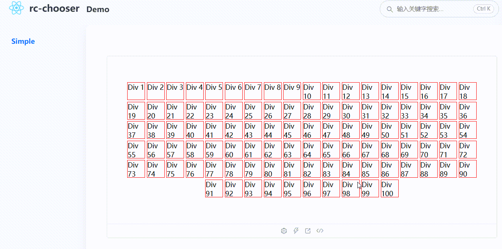

### 简介

鼠标左键批量选中，键盘事件 ESC 清空。



### Install

[](https://npmjs.org/package/rc-chooser)

### Usage

```ts
import React, { useState } from 'react';
import Chooser from '@/index';

const containerStyle: React.CSSProperties = {
  display: 'flex',
  alignItems: 'center',
  justifyContent: 'center',
  flexWrap: 'wrap',
};

const boxStyle: React.CSSProperties = {
  width: 40,
  height: 40,
  border: '1px solid red',
  margin: 2,
};

const Child = React.memo(({ selected }: { selected: string[] }) => {
  return (
    <div className="child" style={containerStyle}>
      {Array.from({ length: 100 }).map((_, index) => {
        const isSelected = selected.includes(`${index}`);
        return (
          <div
            key={index}
            style={{
              ...boxStyle,
              backgroundColor: isSelected ? 'blue' : 'white',
            }}
            data-id={index}
          >
            Div {index + 1}
          </div>
        );
      })}
    </div>
  );
});

export default () => {
  const [selected, setSelected] = useState<string[]>([]);

  const observeHandle = (data: string[]) => {
    setSelected(data);
  };

  return (
    <div style={{ margin: 20 }}>
      <Chooser observeProp="data-id" observeHandle={observeHandle}>
        <Child selected={selected} />
      </Chooser>
    </div>
  );
};

```
